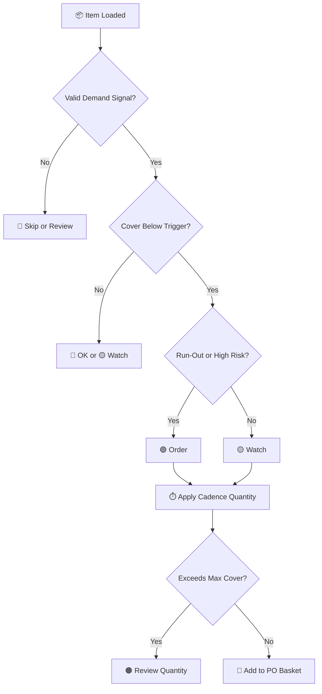
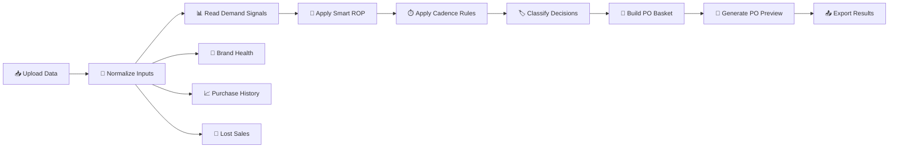

 

# 📦 PO Decision Engine

### Boardroom-grade purchase intelligence for smarter inventory, vendor, and cash-flow decisions

 

  
  
  
  

 

<h3 align="center">Turn raw purchasing data into an auditable PO command center.</h3>

Built for procurement, finance, inventory planning, vendor review, and executive decision-making.

 

  <a href="#-product-experience"><b>Product Preview</b></a>
  ·
  <a href="#-strategic-advantage"><b>Strategic Advantage</b></a>
  ·
  <a href="#-core-capabilities"><b>Capabilities</b></a>
  ·
  <a href="#-business-impact"><b>Business Impact</b></a>
  ·
  <a href="#-quick-start"><b>Quick Start</b></a>

---

 

## 📌 Executive Summary

**PO Decision Engine** is a single-page purchasing intelligence application that helps teams decide **what to buy**, **when to buy**, **how much to buy**, and **why the recommendation is justified**.

It combines demand history, current inventory, vendor lead time, purchase history, gross profit, lost sales, and PO cadence rules into one interactive decision cockpit.

Instead of relying on disconnected spreadsheets, static reorder points, or manual buyer judgment alone, the engine creates a transparent and finance-aware purchasing workflow.

 

<table>
<tr>
<td align="center" width="25%">
<h3>🧾 Plan</h3>

Load item, vendor, demand, lead-time, purchase, and margin data.

</td>
<td align="center" width="25%">
<h3>⚖️ Decide</h3>

Classify items into Order, Watch, Hold, OK, or Skip.

</td>
<td align="center" width="25%">
<h3>🛡️ Control</h3>

Use cadence rules to prevent overbuying and protect working capital.

</td>
<td align="center" width="25%">
<h3>🚀 Execute</h3>

Build a vendor-level PO basket and export results.

</td>
</tr>
</table>

 

---

## 🖥️ Product Experience

### 🎛️ Executive Purchase Cockpit

 

<table>
<tr>
<td align="center" width="20%"><b>📊 Demand Basis</b> Choose how demand is interpreted</td>
<td align="center" width="20%"><b>🧠 Smart ROP</b> Detect reorder risk with item evidence</td>
<td align="center" width="20%"><b>⏱️ Cadence Logic</b> Align quantity with buying cycle</td>
<td align="center" width="20%"><b>🚨 Run-Out Detection</b> Block weak or dormant recommendations</td>
<td align="center" width="20%"><b>🧺 PO Basket</b> Convert analysis into action</td>
</tr>
</table>

 

The cockpit gives buyers and leadership an immediate read on purchase urgency, demand basis, PO cadence, recommended quantity, vendor exposure, and working PO value.

 

---

### ⏱️ Visible PO Cadence Controls

 

Most reorder tools tell users to refill inventory to a target. This engine separates **risk detection** from **purchase execution**.

That means an item can be risky without automatically creating a cash-heavy PO recommendation.

 

<table>
<tr>
<th align="center">Control</th>
<th align="center">Business Purpose</th>
<th align="center">Why It Matters</th>
</tr>
<tr>
<td align="center">📅 Planning Window</td>
<td align="center">Weekly, biweekly, monthly, or custom cycle</td>
<td align="center">Matches real buying rhythm</td>
</tr>
<tr>
<td align="center">🎯 Trigger Cover</td>
<td align="center">Defines when ordering starts</td>
<td align="center">Prevents early buying</td>
</tr>
<tr>
<td align="center">📦 Target Cover</td>
<td align="center">Defines top-up quantity</td>
<td align="center">Keeps quantity practical</td>
</tr>
<tr>
<td align="center">🛑 Max Cover</td>
<td align="center">Caps cover after PO</td>
<td align="center">Protects cash flow</td>
</tr>
<tr>
<td align="center">🧭 Scope</td>
<td align="center">Apply cadence to special vendors or all items</td>
<td align="center">Adds business control</td>
</tr>
</table>

 

---

### 📋 Item-Level Decision Table

 

Every SKU receives a classification, score, recommended quantity, unit value, PO value, and item-level audit trail.

 

<table>
<tr>
<td align="center" width="25%">
<h3>👤 Buyer</h3>

Identify what needs action now.

</td>
<td align="center" width="25%">
<h3>📈 Analyst</h3>

Review logic, score, and quantity assumptions.

</td>
<td align="center" width="25%">
<h3>🧑‍💼 Manager</h3>

Validate PO value before approval.

</td>
<td align="center" width="25%">
<h3>💰 Finance</h3>

Understand inventory investment and cash impact.

</td>
</tr>
</table>

 

---

### 🏥 Brand Health Intelligence

<table>
<tr>
<td width="50%" align="center">

</td>
<td width="50%" align="center">

</td>
</tr>
</table>

 

Brand Health connects purchasing decisions to vendor-level performance. It helps identify which brands are healthy, overstocked, slow moving, margin-constrained, or tying up too much capital.

 

<table>
<tr>
<th align="center">Signal</th>
<th align="center">What It Reveals</th>
<th align="center">Decision Value</th>
</tr>
<tr>
<td align="center">🔄 Inventory Turnover</td>
<td align="center">How efficiently inventory is moving</td>
<td align="center">Supports reorder confidence</td>
</tr>
<tr>
<td align="center">📆 DSI</td>
<td align="center">How long inventory may sit</td>
<td align="center">Flags slow-moving exposure</td>
</tr>
<tr>
<td align="center">💵 Gross Profit</td>
<td align="center">Margin quality by brand</td>
<td align="center">Connects buying to profitability</td>
</tr>
<tr>
<td align="center">🏦 Capital Exposure</td>
<td align="center">Inventory dollars tied to vendor</td>
<td align="center">Protects working capital</td>
</tr>
<tr>
<td align="center">📉 Purchase Trend</td>
<td align="center">Growing, stable, declining, or volatile vendor behavior</td>
<td align="center">Improves vendor review conversations</td>
</tr>
</table>

 

---

### 🚨 Lost Sales Visibility

<table>
<tr>
<td width="50%" align="center">

</td>
<td width="50%" align="center">

</td>
</tr>
</table>

 

Lost Sales helps separate inventory risk from revenue opportunity.

A stockout is not only a supply chain issue. It may also represent missed sales, weaker customer experience, and preventable revenue leakage.

 

---

## 💎 Strategic Advantage

Most PO workflows answer a narrow question:

### “How much inventory is below reorder point?”

The PO Decision Engine answers a stronger business question:

### “What should we buy now, what should we wait on, what cash risk are we creating, and can we defend the recommendation?”

 

<table>
<tr>
<td align="center" width="33%">
<h3>🔍 Transparent Logic</h3>

Demand basis, Smart ROP, cadence rules, run-out detection, and decision categories are visible to the user.

</td>
<td align="center" width="33%">
<h3>💰 Financial Discipline</h3>

Recommendations are tied to PO value, cover limits, vendor exposure, inventory efficiency, and working capital.

</td>
<td align="center" width="33%">
<h3>⚡ Operational Speed</h3>

Buyers move from uploaded data to PO-ready vendor recommendations in one workflow.

</td>
</tr>
</table>

 

---

## ⚙️ Core Capabilities

<table>
<tr>
<td align="left" width="50%" valign="top">

<h3 align="center">🛒 Purchase Decision Engine</h3>

* 🧠 Smart ROP recommendation logic
* 📊 Demand basis selection
* 🧾 SAP legacy comparison mode
* 🏷️ Item-level decision scoring
* 📉 Cover risk detection
* 🚨 Run-out protection
* ⏱️ PO cadence quantity logic
* ✏️ Editable order quantities
* 🧺 Vendor-level PO basket
* 📤 Export-ready item output

</td>
<td align="left" width="50%" valign="top">

<h3 align="center">📊 Executive Analytics Layer</h3>

* 🏥 Brand Health dashboard
* 📈 Purchase history intelligence
* 🚨 Lost sales visibility
* 💵 Margin and gross profit overlay
* 🏦 Vendor capital exposure
* 🔄 Inventory turnover and DSI
* 📊 Inventory-to-sales pressure
* 📆 Year-over-year purchase patterns
* 🧑‍💼 Boardroom-ready visual layout
* ✅ Management review support

</td>
</tr>
</table>

 

---

## 🧭 Decision Framework

<table>
<tr>
<th align="center">Decision</th>
<th align="center">Meaning</th>
<th align="center">Typical Action</th>
</tr>
<tr>
<td align="center">🟢 <b>Order</b></td>
<td align="center">Item requires purchase action now</td>
<td align="center">Add to PO basket</td>
</tr>
<tr>
<td align="center">🟡 <b>Watch</b></td>
<td align="center">Item is approaching risk zone</td>
<td align="center">Monitor or order selectively</td>
</tr>
<tr>
<td align="center">🟠 <b>Hold</b></td>
<td align="center">Buying now may create excess inventory</td>
<td align="center">Do not order yet</td>
</tr>
<tr>
<td align="center">🔵 <b>OK</b></td>
<td align="center">Current inventory position is healthy</td>
<td align="center">No immediate action</td>
</tr>
<tr>
<td align="center">🔴 <b>Skip</b></td>
<td align="center">Item lacks reliable demand or is blocked by logic</td>
<td align="center">Exclude from PO</td>
</tr>
</table>

 

 

---

## 🔄 Engine Flow

 

---

## 🧠 Logic and Inputs

### Smart ROP Layer

The Smart ROP layer identifies purchase risk using item-level demand evidence.

<table>
<tr>
<th align="center">Component</th>
<th align="center">Purpose</th>
</tr>
<tr>
<td align="center">📊 Demand Evidence</td>
<td align="center">Determines expected movement</td>
</tr>
<tr>
<td align="center">🚚 Lead Time</td>
<td align="center">Accounts for vendor replenishment time</td>
</tr>
<tr>
<td align="center">📅 Review Period</td>
<td align="center">Reflects planning horizon</td>
</tr>
<tr>
<td align="center">🛡️ Safety Buffer</td>
<td align="center">Protects against uncertainty</td>
</tr>
<tr>
<td align="center">📦 Inventory Position</td>
<td align="center">Measures available and incoming stock</td>
</tr>
<tr>
<td align="center">🚨 Run-Out Rule</td>
<td align="center">Blocks dormant or weak recommendations</td>
</tr>
</table>

 

### PO Cadence Layer

The cadence layer controls the recommended buying quantity.

<table>
<tr>
<th align="center">Cadence Control</th>
<th align="center">Purpose</th>
</tr>
<tr>
<td align="center">📆 Weekly PO</td>
<td align="center">Short-cycle replenishment</td>
</tr>
<tr>
<td align="center">🗓️ Biweekly PO</td>
<td align="center">Medium-cycle buying</td>
</tr>
<tr>
<td align="center">📅 Monthly PO</td>
<td align="center">Longer planning window</td>
</tr>
<tr>
<td align="center">🛠️ Custom Days</td>
<td align="center">User-defined planning cycle</td>
</tr>
<tr>
<td align="center">🎯 Trigger Cover</td>
<td align="center">Defines when buying starts</td>
</tr>
<tr>
<td align="center">📦 Target Cover</td>
<td align="center">Defines top-up level</td>
</tr>
<tr>
<td align="center">🛑 Max Cover After PO</td>
<td align="center">Prevents excess inventory</td>
</tr>
</table>

 

---

## 🗂️ Data Model

The engine supports one workbook with up to four sheets.

<table>
<tr>
<th align="center">Sheet Name</th>
<th align="center">Purpose</th>
</tr>
<tr>
<td align="center"><code>PO_Recommendation</code></td>
<td align="center">Main item-level planning data</td>
</tr>
<tr>
<td align="center"><code>Brand_Sales_GP</code></td>
<td align="center">Brand sales, cost, gross profit, and margin overlay</td>
</tr>
<tr>
<td align="center"><code>Lead_Time_History</code></td>
<td align="center">Real PO-to-receipt lead-time history</td>
</tr>
<tr>
<td align="center"><code>Purchase_History</code></td>
<td align="center">Vendor purchase totals by year</td>
</tr>
</table>

 

Supported input methods:

<table>
<tr>
<td align="center" width="20%">📗 Excel Workbook</td>
<td align="center" width="20%">📄 CSV File</td>
<td align="center" width="20%">🧮 SSMS Paste</td>
<td align="center" width="20%">🧪 Demo Data</td>
<td align="center" width="20%">🧩 Module Uploads</td>
</tr>
</table>

 

---

## 📈 Business Impact

<table>
<tr>
<td align="center" width="33%" valign="top">

<h3>🚚 Operational Impact</h3>

Faster PO review
Clearer item prioritization
Better stockout visibility
Better vendor grouping
Reduced manual spreadsheet work
More consistent buyer decisions

</td>
<td align="center" width="33%" valign="top">

<h3>💰 Financial Impact</h3>

Better PO value control
Reduced overbuying risk
Improved inventory discipline
Better capital allocation
Stronger margin context
Clearer vendor exposure

</td>
<td align="center" width="33%" valign="top">

<h3>🧑‍💼 Management Impact</h3>

Audit-ready recommendations
Better leadership visibility
Stronger procurement governance
Better vendor review conversations
Repeatable decision process
Clearer accountability

</td>
</tr>
</table>

 

---

## 🧩 Critical Thinking Layer

The engine is designed to support decisions, not replace judgment.

Before approving a PO, review the following:

<table>
<tr>
<th align="center">Question</th>
<th align="center">Why It Matters</th>
</tr>
<tr>
<td align="center">🔍 Is the demand signal reliable?</td>
<td align="center">Weak demand can create false recommendations</td>
</tr>
<tr>
<td align="center">🌦️ Is the item seasonal?</td>
<td align="center">Seasonal SKUs need context</td>
</tr>
<tr>
<td align="center">📦 Is inventory accurate?</td>
<td align="center">Bad stock data creates bad PO decisions</td>
</tr>
<tr>
<td align="center">🚚 Is lead time realistic?</td>
<td align="center">Lead-time changes affect reorder risk</td>
</tr>
<tr>
<td align="center">📅 Is the next PO date correct?</td>
<td align="center">Cadence depends on real buying timing</td>
</tr>
<tr>
<td align="center">🛑 Does the order exceed target cover?</td>
<td align="center">Prevents cash-heavy overbuying</td>
</tr>
<tr>
<td align="center">🧊 Is the item obsolete or slow moving?</td>
<td align="center">Avoids investing in dead stock</td>
</tr>
<tr>
<td align="center">🏦 Does the vendor deserve more capital?</td>
<td align="center">Connects buying to vendor performance</td>
</tr>
<tr>
<td align="center">🚨 Are lost sales real demand?</td>
<td align="center">Separates opportunity from noise</td>
</tr>
<tr>
<td align="center">✅ Can the decision be defended?</td>
<td align="center">Ensures business accountability</td>
</tr>
</table>

 

---

## 👥 Who This Is For

<table>
<tr>
<td align="center" width="25%" valign="top">
<h3>🛒 Procurement</h3>

Build PO baskets and review item-level recommendations.

</td>
<td align="center" width="25%" valign="top">
<h3>💰 Finance</h3>

Evaluate PO value, inventory exposure, and cash-flow impact.

</td>
<td align="center" width="25%" valign="top">
<h3>🚚 Operations</h3>

Identify stockout risk, fulfillment pressure, and lead-time gaps.

</td>
<td align="center" width="25%" valign="top">
<h3>🧑‍💼 Leadership</h3>

Review vendor health, capital allocation, and purchasing discipline.

</td>
</tr>
</table>

 

---

## 🛣️ Roadmap

<table>
<tr>
<td align="center" width="25%">🔗 ERP write-back</td>
<td align="center" width="25%">🧾 Automated PO drafts</td>
<td align="center" width="25%">📦 MOQ and case-pack logic</td>
<td align="center" width="25%">💰 Budget simulation</td>
</tr>
<tr>
<td align="center">✅ Approval workflow</td>
<td align="center">🎯 Service-level optimization</td>
<td align="center">📈 Forecast tracking</td>
<td align="center">📊 Vendor scorecards</td>
</tr>
<tr>
<td align="center">🧠 Recommendation history</td>
<td align="center">🔌 API integration</td>
<td align="center">📉 Power BI export</td>
<td align="center">🧪 Scenario testing</td>
</tr>
</table>

 

---

## ⚠️ Disclaimer

This engine provides decision support based on uploaded data and configured assumptions. Final purchasing decisions should be reviewed by the responsible business owner, especially when seasonality, vendor constraints, MOQ rules, or cash-flow limits may affect the recommendation.

 

---

## 📦 PO Decision Engine

### Smarter purchase orders. Cleaner cash control. Stronger decisions.

 

  
  
  

 

<b>If this project helps your purchasing workflow, consider starring the repository.</b>

