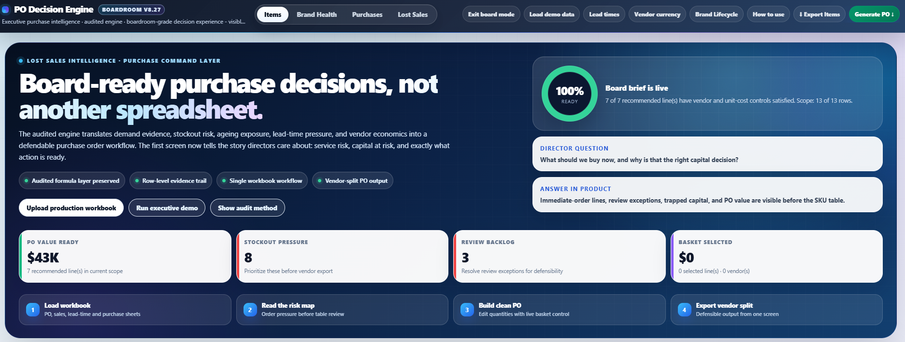
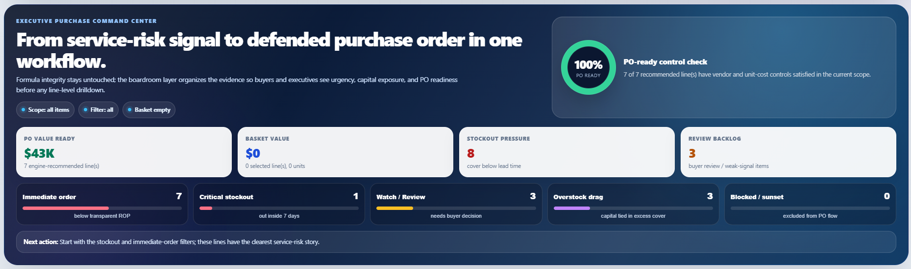
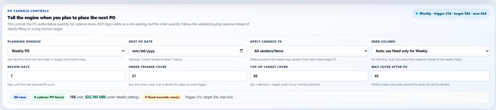
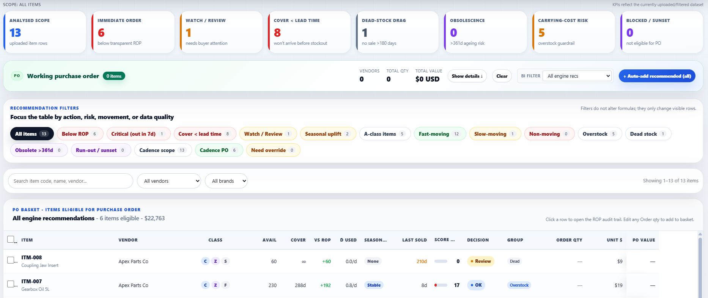
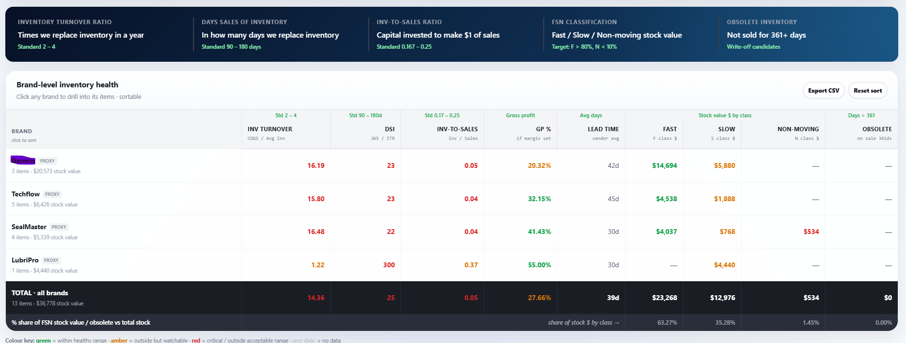
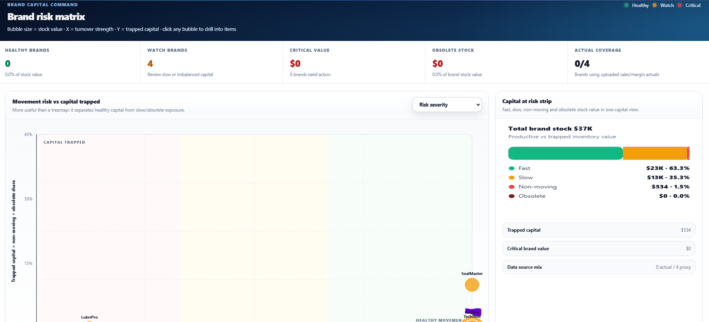
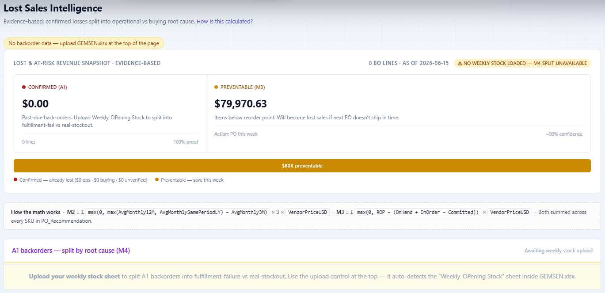
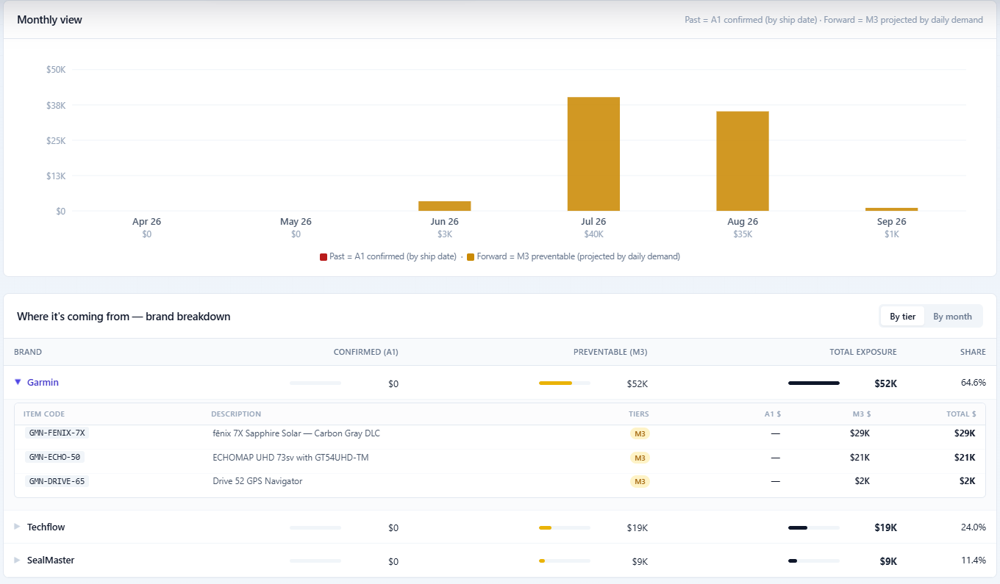
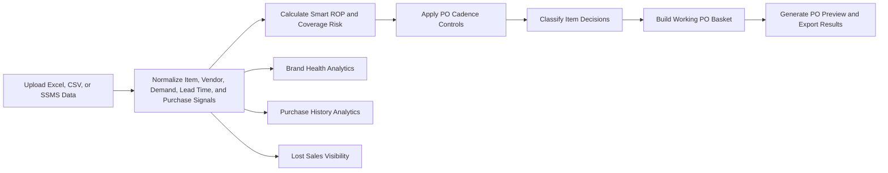
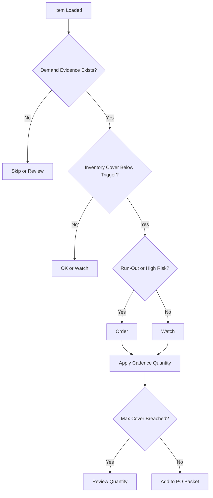

<div align="center">

# 🧠 PO Decision Engine

### Executive Purchase Intelligence for Smarter, Faster, Auditable PO Decisions

**PO Decision Engine** transforms raw inventory, sales, lead-time, vendor, and purchase history data into a boardroom-ready purchasing command center. It helps procurement, finance, and operations teams decide **what to buy, when to buy, how much to buy, and why the recommendation makes sense**.

<br/>



<br/>


</div>

---

## Why This Exists

Traditional purchase planning is often driven by scattered spreadsheets, manual judgment, static reorder points, and vendor-by-vendor guesswork.

The **PO Decision Engine** was built to solve that problem.

It gives buyers and analysts a single decision cockpit where every item is scored, classified, filtered, explained, and converted into a working PO basket. The goal is not just to generate a purchase order. The goal is to make every purchasing decision **transparent, defensible, and financially intelligent**.

---

## Product Vision

> **Turn purchasing from a reactive spreadsheet process into an intelligent decision system.**

The engine is designed to help teams reduce stockouts, avoid overbuying, protect cash flow, identify vendor risk, improve service levels, and explain purchase decisions with clear evidence.

---

## Screenshot Gallery

### Executive Dashboard



### Visible PO Cadence Controls



### Item-Level Decision Table



### Brand Health Analytics




### Purchase History Intelligence


### Lost Sales View





---

## What the Engine Does

The PO Decision Engine combines operational inventory data with purchasing logic and executive-level visualization.

It helps answer:

| Business Question                       | Engine Output                                     |
| --------------------------------------- | ------------------------------------------------- |
| Which items need to be ordered now?     | Order, Watch, Hold, OK, Skip decisions            |
| How much should we buy?                 | Recommended order quantity and PO value           |
| Is the recommendation explainable?      | Expanded item audit and formula evidence          |
| Are we buying too much too early?       | Visible cadence controls and cover limits         |
| Which vendors are risky?                | Brand Health, DSI, inventory exposure, GP overlay |
| Which vendors are growing or declining? | Purchase History tab with year-over-year view     |
| What sales are we losing?               | Lost Sales view and opportunity visibility        |
| What should go into the PO?             | Working PO Basket grouped by vendor               |

---

## Core Highlights

### 1. Executive Purchase Decision Cockpit

The dashboard presents purchase decisions in a clean, boardroom-grade interface. Users can load data, inspect KPIs, filter decisions, review risk, and generate a PO without moving between multiple files.

Key cockpit features:

* Item-level purchase recommendation
* Demand basis selector
* Smart ROP and SAP legacy mode toggle
* Run-out detection
* PO cadence evidence
* KPI cards for fast executive review
* Working PO Basket with editable quantity controls

---

### 2. Transparent Smart ROP Logic

The engine avoids blind reorder-point logic. It uses item-level demand signals from the uploaded file and keeps the calculation visible.

The engine supports multiple demand modes:

| Demand Mode                  | Purpose                                                   |
| ---------------------------- | --------------------------------------------------------- |
| Conservative evidence median | Default, safer demand signal using positive item evidence |
| SQL DailyDemand              | Uses uploaded demand exactly as provided                  |
| Recent 3M                    | Prioritizes recent movement                               |
| Trailing 12M                 | Uses longer-term demand behavior                          |
| Same-period LY               | Helps with seasonal comparisons                           |

This allows teams to choose a planning assumption that fits the business context instead of relying on one hidden formula.

---

### 3. Visible PO Cadence Controls

One of the strongest features of v8.28 is the **PO cadence panel**.

Instead of silently filling inventory to a long-horizon target, the engine lets the user explicitly control how often the next PO will be placed.

Supported cadence options:

* Weekly PO
* Every 2 weeks
* Monthly PO
* Custom days
* Next PO date
* Trigger cover days
* Target cover days
* Maximum cover after PO
* Scope control for special vendors or all items

This protects cash flow and prevents over-ordering when the buyer only needs to bridge until the next purchase cycle.

---

### 4. Working PO Basket

The Working PO Basket turns analysis into action.

Users can:

* Add recommended items to the PO basket
* Review items grouped by vendor
* Edit order quantities
* Remove items
* See total units and PO value
* Generate a PO preview
* Export filtered item decisions

This keeps the workflow practical for real purchasing teams.

---

### 5. Brand Health Dashboard

The Brand Health view moves beyond item-level buying and evaluates vendors at a portfolio level.

It can use uploaded brand-level sales and margin data to upgrade proxy calculations into actual performance metrics.

Brand Health can help evaluate:

* Inventory turnover
* Days sales of inventory
* Inventory-to-sales exposure
* Gross profit percentage
* Vendor concentration
* Slow-moving brand risk
* Capital tied up by brand

This is useful for finance, procurement, leadership, and vendor negotiations.

---

### 6. Purchase History Intelligence

The Purchases tab helps users compare vendor purchase behavior across years.

It supports year-over-year purchasing data and highlights whether vendor buying is:

* Growing
* Stable
* Declining
* Volatile
* New or emerging

This gives context to current recommendations and helps separate healthy replenishment from risky purchasing patterns.

---

### 7. Lost Sales Visibility

The Lost Sales tab helps identify demand that could not be captured due to availability gaps.

This is critical because a low stock item is not just an inventory problem. It may also represent missed revenue, weak service level, and poor customer experience.

---

## Data Inputs

The engine supports a flexible single-file workflow.

Upload one `.xlsx` workbook with up to four sheets:

| Sheet Name          | Purpose                              |
| ------------------- | ------------------------------------ |
| `PO_Recommendation` | Main item-level recommendation data  |
| `Brand_Sales_GP`    | Brand sales and gross profit overlay |
| `Lead_Time_History` | Real PO-to-receipt lead times        |
| `Purchase_History`  | Vendor purchase history by year      |

It also supports:

* Excel upload
* CSV upload
* SSMS copy and paste
* Demo data loading
* Optional advanced uploads by module

---

## Recommended Repository Structure

```text
po-decision-engine/
│
├── README.md
├── index.html
├── docs/
│   └── assets/
│       ├── po-engine-dashboard.png
│       ├── po-engine-cadence-controls.png
│       ├── po-engine-item-decisions.png
│       ├── po-engine-brand-health.png
│       ├── po-engine-purchases.png
│       └── po-engine-lost-sales.png
│
├── sample-data/
│   ├── demo-po-recommendation.xlsx
│   └── sample-input-template.xlsx
│
└── notes/
    └── decision-methodology.md
```

---

## How It Works



---

## Decision Flow



---

## Key Results Derived From the Engine

The PO Decision Engine produces both operational and financial outputs.

### Operational Results

* Items requiring immediate purchase action
* Items that should be watched but not ordered yet
* Items that should be held or skipped
* Recommended order quantity
* Days of cover before and after order
* Vendor-grouped PO basket
* Exportable item-level decision table

### Financial Results

* Total recommended PO value
* Capital exposure by vendor
* Overbuying risk
* Inventory-to-sales pressure
* Gross profit overlay by brand
* Vendor-level purchase trend
* Lost sales opportunity

### Management Results

* Clear explanation of why each item is recommended
* Better alignment between procurement, finance, and operations
* Faster PO review
* Less dependency on manual spreadsheet interpretation
* More defensible buying decisions

---

## Why Use This Engine?

Use the PO Decision Engine when the business needs to:

* Reduce stockouts
* Avoid overbuying
* Improve inventory turns
* Protect cash flow
* Increase buyer confidence
* Standardize PO decision logic
* Improve vendor review conversations
* Create audit-ready purchase recommendations
* Move from reactive buying to planned replenishment

This is especially valuable when a company has many SKUs, many vendors, inconsistent lead times, and manual purchasing workflows.

---

## Pros

| Strength                         | Why It Matters                         |
| -------------------------------- | -------------------------------------- |
| Single-page executive experience | Reduces friction and improves adoption |
| Smart ROP logic                  | Better than static reorder points      |
| Visible cadence controls         | Prevents hidden overbuying             |
| Vendor and item-level views      | Supports both buyers and leadership    |
| Demo data support                | Easy to test without production data   |
| Excel and SSMS friendly          | Fits existing analyst workflows        |
| Explainable decisions            | Builds trust in recommendations        |
| Export capability                | Connects analysis to action            |

---

## Challenges

| Challenge                              | Consideration                                                        |
| -------------------------------------- | -------------------------------------------------------------------- |
| Data quality matters                   | Bad demand, lead-time, or inventory data can distort recommendations |
| Business rules need ownership          | Teams must agree on cadence, cover, and trigger assumptions          |
| Vendor behavior changes                | Lead times and buying patterns should be refreshed regularly         |
| Seasonality requires care              | Seasonal products need thoughtful demand mode selection              |
| MOQ and pack sizes may need refinement | Real-world vendor constraints should be layered into the model       |
| Adoption requires change management    | Buyers need to trust the engine and review its reasoning             |

---

## Critical Thinking Points

Before using recommendations directly, ask:

1. Is the demand signal reliable?
2. Is the item seasonal?
3. Is the vendor lead time stable?
4. Is there a minimum order quantity?
5. Is the current inventory position accurate?
6. Is the next PO date realistic?
7. Is the item obsolete, slow-moving, or being phased out?
8. Does the recommended PO value fit cash-flow priorities?
9. Are lost sales caused by stockouts or by weak demand?
10. Should this item be ordered now, or only watched?

The engine is designed to support decisions, not remove business judgment.

---

## Ideal Users

This tool is useful for:

* Procurement analysts
* Inventory planners
* Finance analysts
* Supply chain teams
* Purchasing managers
* Operations leaders
* Vendor managers
* ERP and reporting teams

---

## Example Use Cases

### Procurement Team

A buyer loads the latest PO recommendation file, reviews items flagged as Order or Watch, adjusts quantities, and generates a PO basket by vendor.

### Finance Team

A financial analyst reviews PO value, brand exposure, inventory-to-sales ratio, and gross profit overlay to understand how purchasing affects cash flow.

### Leadership Team

An executive reviews the dashboard screenshots and Brand Health tab to understand which vendors are healthy, risky, overstocked, or under-supported.

### Vendor Review

A manager uses Purchase History and Brand Health analytics to discuss vendor performance, lead time behavior, and future purchasing strategy.

---

## Suggested KPIs to Track

| KPI                  | Why It Matters                              |
| -------------------- | ------------------------------------------- |
| Recommended PO Value | Measures immediate capital requirement      |
| Order Count          | Shows number of actionable items            |
| Watch Count          | Shows near-term risk pipeline               |
| Days of Cover        | Indicates stockout or overstock risk        |
| Inventory Turnover   | Measures efficiency of inventory investment |
| DSI                  | Shows how long inventory is likely to sit   |
| Gross Profit %       | Adds profitability context                  |
| Lost Sales           | Highlights missed revenue opportunity       |
| Vendor Concentration | Shows dependency risk                       |

---

## Ultimate Goal

The ultimate goal of the PO Decision Engine is to create a reliable bridge between **data, purchasing action, and financial discipline**.

It should help the organization answer:

> “What should we buy today, how much should we spend, what risk are we solving, and can we explain the decision?”

When used correctly, the engine becomes more than a dashboard. It becomes a repeatable purchasing control system.

---

## Future Enhancements

Potential future improvements:

* ERP write-back support
* Automated PO draft generation
* Vendor MOQ and case-pack logic
* Budget limit scenario planning
* Safety stock simulation
* Approval workflow
* Service-level optimization
* Forecast comparison
* Historical recommendation accuracy tracking
* Power BI or API integration

---

## Quick Start

1. Open the PO Decision Engine HTML file.
2. Click **Load demo data** to explore the workflow.
3. Upload your own Excel or CSV file.
4. Review the Executive Purchase Decision Cockpit.
5. Adjust PO cadence controls.
6. Filter items by decision category.
7. Add recommended items to the Working PO Basket.
8. Review vendor-level PO totals.
9. Generate PO preview.
10. Export final item or PO results.

---

## Design Philosophy

The interface is designed around three principles:

### 1. Clarity

Every recommendation should be easy to understand.

### 2. Control

Buyers should be able to adjust cadence, quantities, filters, and decision views.

### 3. Confidence

Finance, procurement, and leadership should be able to trust the recommendation because the logic is visible.

---

## Disclaimer

This tool provides decision support based on uploaded data and configured assumptions. Final purchase decisions should be reviewed by the responsible business owner, especially when data quality, seasonality, vendor constraints, or cash-flow limits may affect the recommendation.

---

<div align="center">

## PO Decision Engine

**Smarter purchase orders. Better cash control. Clearer decisions.**

</div>
