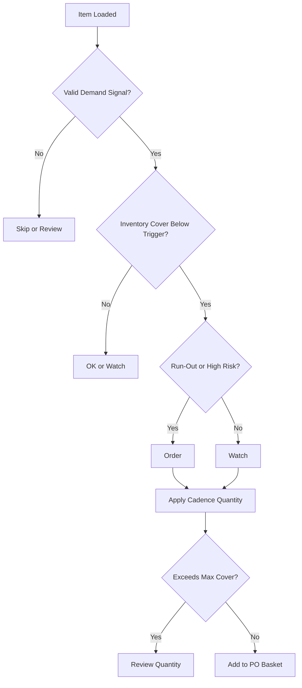
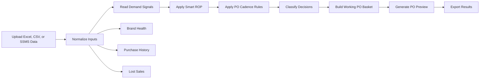

 

# PO Decision Engine

### Boardroom-grade purchase intelligence for inventory, vendor, and cash-flow control

  
  
  
  

 

<b>Turn raw purchasing data into an auditable PO command center.</b>

Built for procurement, finance, inventory planning, vendor review, and executive decision-making.

---

## Table of Contents

* [Executive Summary](#executive-summary)
* [Product Experience](#product-experience)
* [Strategic Advantage](#strategic-advantage)
* [Core Capabilities](#core-capabilities)
* [Decision Framework](#decision-framework)
* [Engine Flow](#engine-flow)
* [Data Model](#data-model)
* [Business Impact](#business-impact)
* [Critical Thinking Layer](#critical-thinking-layer)
* [Quick Start](#quick-start)
* [Roadmap](#roadmap)

---

## Executive Summary

**PO Decision Engine** is a single-page purchasing intelligence application that helps teams decide:

<table>
<tr>
<td width="25%" align="center"><b>What to buy</b></td>
<td width="25%" align="center"><b>When to buy</b></td>
<td width="25%" align="center"><b>How much to buy</b></td>
<td width="25%" align="center"><b>Why it matters</b></td>
</tr>
</table>

It combines demand history, current inventory, vendor lead time, purchase history, gross profit, lost sales, and cadence rules into one decision cockpit.

The goal is not only to generate a PO. The goal is to create a purchasing process that is transparent, repeatable, finance-aware, and defensible.

 

<table>
<tr>
<td width="25%" valign="top">

### Plan

Load item, vendor, demand, lead-time, purchase, and margin data.

</td>
<td width="25%" valign="top">

### Decide

Classify items into Order, Watch, Hold, OK, or Skip.

</td>
<td width="25%" valign="top">

### Control

Use cadence rules to prevent overbuying and protect working capital.

</td>
<td width="25%" valign="top">

### Execute

Build a vendor-level PO basket and export results.

</td>
</tr>
</table>

---

## Product Experience

### Executive Purchase Cockpit

The cockpit gives buyers and leadership an immediate read on purchase urgency, demand basis, PO cadence, recommended quantity, vendor exposure, and working PO value.

 

<b>View the decision cockpit highlights</b>

 

| Area              | What It Provides                                   |
| ----------------- | -------------------------------------------------- |
| Demand Basis      | Lets users choose how demand should be interpreted |
| Smart ROP         | Shows reorder risk using item-level evidence       |
| Cadence Control   | Aligns quantity with the next buying cycle         |
| Run-Out Detection | Blocks weak or dormant recommendations             |
| KPI Cards         | Summarizes purchasing risk and PO value            |
| Working Basket    | Converts analysis into actionable vendor PO lines  |

---

### Visible PO Cadence Controls

The cadence layer is one of the most important parts of the engine.

Most reorder tools tell users to fill inventory to a target. This engine separates risk detection from purchase execution. That means an item can be risky without automatically creating an excessive PO quantity.

<b>What cadence controls solve</b>

 

| Control            | Why It Matters                                              |
| ------------------ | ----------------------------------------------------------- |
| Planning Window    | Matches the next PO cycle                                   |
| Trigger Cover      | Prevents early buying                                       |
| Target Cover       | Defines practical top-up quantity                           |
| Max Cover After PO | Protects against cash-heavy recommendations                 |
| Scope              | Applies cadence only where needed                           |
| Need Column Mode   | Controls whether uploaded need should override engine logic |

---

### Item-Level Decision Table

Every SKU receives a classification, score, recommended quantity, unit value, PO value, and item-level audit trail.

<b>What the item table is designed for</b>

 

| User    | Value                                             |
| ------- | ------------------------------------------------- |
| Buyer   | Quickly identify what needs action                |
| Analyst | Review the calculation behind each recommendation |
| Manager | Validate quantity and PO value before approval    |
| Finance | Understand inventory investment and cash impact   |

---

### Brand Health Intelligence

<table>
<tr>
<td width="50%">

</td>
<td width="50%">

</td>
</tr>
</table>

Brand Health connects purchasing decisions to vendor-level performance.

It helps identify which brands are healthy, overstocked, slow moving, margin-constrained, or tying up too much capital.

<b>Brand Health signals</b>

 

| Signal             | Business Use                                          |
| ------------------ | ----------------------------------------------------- |
| Inventory Turnover | Measures how efficiently inventory is moving          |
| DSI                | Shows how many days inventory may sit                 |
| Inventory-to-Sales | Highlights capital intensity                          |
| Gross Profit       | Adds margin context to buying decisions               |
| Vendor Exposure    | Shows concentration and cash risk                     |
| Purchase Trend     | Reveals whether vendor buying is growing or declining |

---

### Lost Sales Visibility

<table>
<tr>
<td width="50%">

</td>
<td width="50%">

</td>
</tr>
</table>

Lost Sales helps separate inventory risk from revenue opportunity.

A stockout is not only a supply chain issue. It may also represent missed sales, weaker customer experience, and preventable revenue leakage.

---

## Strategic Advantage

Most PO workflows answer a narrow question:

> How much inventory is below reorder point?

This engine answers a more useful business question:

> What should we buy now, what should we wait on, what cash risk are we creating, and can we defend the recommendation?

 

<table>
<tr>
<td width="33%" valign="top">

### Transparent Logic

Demand basis, Smart ROP, cadence rules, run-out detection, and decision categories are visible to the user.

</td>
<td width="33%" valign="top">

### Financial Discipline

Recommendations are tied to PO value, cover limits, vendor exposure, inventory efficiency, and working capital.

</td>
<td width="33%" valign="top">

### Operational Speed

Buyers can move from uploaded data to PO-ready vendor recommendations in one workflow.

</td>
</tr>
</table>

---

## Core Capabilities

<table>
<tr>
<td width="50%" valign="top">

### Purchase Decision Engine

* Smart ROP recommendation logic
* Demand basis selection
* SAP legacy comparison mode
* Item-level decision scoring
* Cover risk detection
* Run-out protection
* PO cadence quantity logic
* Editable order quantities
* Vendor-level PO basket
* Export-ready item output

</td>
<td width="50%" valign="top">

### Executive Analytics Layer

* Brand Health dashboard
* Purchase history intelligence
* Lost sales visibility
* Margin and gross profit overlay
* Vendor capital exposure
* Inventory turnover and DSI
* Inventory-to-sales pressure
* Year-over-year purchase patterns
* Boardroom-ready visual layout
* Management review support

</td>
</tr>
</table>

---

## Decision Framework

| Decision  | Meaning                                           | Typical Action               |
| --------- | ------------------------------------------------- | ---------------------------- |
| **Order** | Item requires purchase action now                 | Add to PO basket             |
| **Watch** | Item is approaching risk zone                     | Monitor or order selectively |
| **Hold**  | Buying now may create excess inventory            | Do not order yet             |
| **OK**    | Current inventory position is healthy             | No immediate action          |
| **Skip**  | Item lacks reliable demand or is blocked by logic | Exclude from PO              |

 

---

## Engine Flow

---

## Logic and Inputs

### Smart ROP Layer

The Smart ROP layer identifies purchase risk using item-level demand evidence.

It is designed to make the risk signal visible, not hidden.

| Component          | Purpose                                |
| ------------------ | -------------------------------------- |
| Demand Evidence    | Determines expected movement           |
| Lead Time          | Accounts for vendor replenishment time |
| Review Period      | Reflects planning horizon              |
| Safety Buffer      | Protects against uncertainty           |
| Inventory Position | Measures available and incoming stock  |
| Run-Out Rule       | Blocks dormant or weak recommendations |

---

### PO Cadence Layer

The cadence layer controls the actual recommended buying quantity.

| Cadence Control    | Purpose                                         |
| ------------------ | ----------------------------------------------- |
| Weekly PO          | Short-cycle replenishment                       |
| Biweekly PO        | Medium-cycle buying                             |
| Monthly PO         | Longer planning window                          |
| Custom Days        | User-defined planning cycle                     |
| Trigger Cover      | Defines when buying starts                      |
| Target Cover       | Defines top-up level                            |
| Max Cover After PO | Prevents excess inventory                       |
| Scope              | Applies cadence to selected vendors or all rows |

---

## Data Model

The engine supports one workbook with up to four sheets.

| Sheet Name          | Purpose                                             |
| ------------------- | --------------------------------------------------- |
| `PO_Recommendation` | Main item-level planning data                       |
| `Brand_Sales_GP`    | Brand sales, cost, gross profit, and margin overlay |
| `Lead_Time_History` | Real PO-to-receipt lead-time history                |
| `Purchase_History`  | Vendor purchase totals by year                      |

Supported input methods:

* Excel workbook
* CSV file
* SSMS copy and paste
* Demo data
* Optional individual module uploads

---

## Business Impact

<table>
<tr>
<td width="33%" valign="top">

### Operational Impact

* Faster PO review
* Clearer item prioritization
* Better stockout visibility
* Better vendor grouping
* Reduced manual spreadsheet work
* More consistent buyer decisions

</td>
<td width="33%" valign="top">

### Financial Impact

* Better PO value control
* Reduced overbuying risk
* Improved inventory discipline
* Better capital allocation
* Stronger margin context
* Clearer vendor exposure

</td>
<td width="33%" valign="top">

### Management Impact

* Audit-ready recommendations
* Better leadership visibility
* Stronger procurement governance
* Better vendor review conversations
* Repeatable decision process
* Clearer accountability

</td>
</tr>
</table>

---

## Critical Thinking Layer

The engine is designed to support decisions, not replace judgment.

Before approving a PO, review the following:

| Question                              | Why It Matters                               |
| ------------------------------------- | -------------------------------------------- |
| Is the demand signal reliable?        | Weak demand can create false recommendations |
| Is the item seasonal?                 | Seasonal SKUs need context                   |
| Is the inventory position accurate?   | Bad stock data creates bad PO decisions      |
| Is the lead time realistic?           | Lead-time changes affect reorder risk        |
| Is the next PO date correct?          | Cadence depends on real buying timing        |
| Does the order exceed target cover?   | Prevents cash-heavy overbuying               |
| Is the item obsolete or slow moving?  | Avoids investing in dead stock               |
| Does the vendor deserve more capital? | Connects buying to vendor performance        |
| Are lost sales real demand?           | Separates opportunity from noise             |
| Can the decision be defended?         | Ensures business accountability              |

---

## Who This Is For

<table>
<tr>
<td width="25%" align="center" valign="top">

### Procurement

Build PO baskets and review item-level recommendations.

</td>
<td width="25%" align="center" valign="top">

### Finance

Evaluate PO value, inventory exposure, and cash-flow impact.

</td>
<td width="25%" align="center" valign="top">

### Operations

Identify stockout risk, fulfillment pressure, and lead-time gaps.

</td>
<td width="25%" align="center" valign="top">

### Leadership

Review vendor health, capital allocation, and purchasing discipline.

</td>
</tr>
</table>

---

## Recommended Workflow

1. Open the dashboard.
2. Load demo data or upload the planning workbook.
3. Review the Executive Purchase Cockpit.
4. Select the demand basis.
5. Set the PO cadence.
6. Filter by decision category.
7. Review item-level audit details.
8. Add recommended items to the PO basket.
9. Adjust quantities if needed.
10. Generate and export the final PO output.

---

## Roadmap

* ERP write-back support
* Automated PO draft creation
* MOQ and case-pack optimization
* Budget-constrained purchase simulation
* Approval workflow
* Service-level optimization
* Forecast accuracy tracking
* Recommendation history
* Vendor scorecard export
* Power BI or API integration

---

## Disclaimer

This engine provides decision support based on uploaded data and configured assumptions. Final purchasing decisions should be reviewed by the responsible business owner, especially when seasonality, vendor constraints, MOQ rules, or cash-flow limits may affect the recommendation.

---

## PO Decision Engine

### Smarter purchase orders. Cleaner cash control. Stronger decisions.

  
  
  

